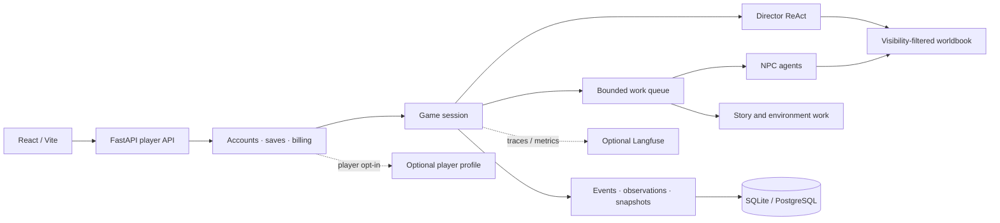

# StoryLoop Platform

[中文](README.md) · [English](README.en.md)

StoryLoop Platform is a multi-agent runtime and player platform for AI interactive fiction. It connects open-ended player input, independent characters, a changing world, and scheduled story beats in one traceable causal flow: player actions update authoritative game state, characters respond using only information available to them, and the runtime presents the visible outcome as a story.

## Problems it addresses

- **Consistent character knowledge:** world facts, character knowledge, and player-visible information have separate boundaries. Committed events define world state; observations and worldbook entries are delivered according to visibility rules.
- **Open interaction with narrative momentum:** players can talk, inspect, and act while queued work, story events, and elapsed time continue to advance. A per-turn work budget prevents unbounded agent interaction.
- **Recoverable long-running play:** accounts, single-player saves, events, observations, turn results, and credit transactions are persisted. Request IDs support retrying the same action after a model failure.
- **Replaceable infrastructure:** model routes, storage, observability, and player profiles connect through configuration or interfaces, keeping scenario content separate from the platform runtime.

## Capabilities

| Component | Responsibility |
| --- | --- |
| Scenario packages and worldbook | Versioned character cards, initial state, action rules, opening text, scheduled work, and a JSON worldbook filtered by player or actor visibility before retrieval. |
| Narrative runtime | A director ReAct agent interprets input and coordinates actions; NPCs use independent AgentScope agents; a bounded work queue processes replies, environmental changes, and story events. |
| State and time | Committed events update snapshots and produce recipient-specific observations; campaign scenarios combine scheduled milestones with elapsed time based on action duration. |
| Player platform | React and FastAPI provide accounts, a catalog, private scenario uploads, single-player saves, resume, and history; SSE streams turn stages and committed visible story segments. |
| Content moderation | Authors submit immutable scenario versions; reviewers inspect submissions and play isolated previews; administrators manage roles, account status, public releases, private-test invitations, and audit records. |
| Billing and profiles | Credits are settled from actual model token usage on successful turns; optional Mem0 extracts player-approved play preferences separately from NPC knowledge and game facts. |
| Observability | Optional Langfuse traces, sessions, and metrics expose model calls and work processing within a turn. |

## Architecture



On each turn, the director reads permitted world knowledge and current state to decide what the player action affects. The runtime commits events, projects observations, and processes causally queued work. The presentation layer assembles the player-visible result and keeps next-step guidance separate from story prose. Work handlers are registered by task type; execution does not depend on a fixed agent graph. Scenario packages provide content, while the platform handles execution, isolation, and persistence.

Authoritative game data is separate from agent context. `GameStore` manages events, observations, snapshots, and pending work; SQLAlchemy repositories use SQLite locally and PostgreSQL online. The worldbook currently uses visibility-scoped JSON entry retrieval rather than vector RAG. Models are routed per task through an OpenAI-compatible API. Online browser sessions use `Secure`, `HttpOnly` cookies.

## Repository layout

```text
src/story_harness/
  core/       Events, state transitions, perception, and billing contracts
  world/      Scenario packages and worldbook
  agents/     Director, NPC, selector, and narrator agents
  runtime/    Turn scheduling, campaign flow, story time, and presentation
  adapters/   Model configuration, SQL storage, and telemetry
  portal/     Accounts, saves, profiles, credits, and HTTP API
  cli/        Local demos and service entry points
web/          React frontend
config/       Local and online configuration examples
examples/     Public synthetic scenario packages
deploy/ecs/   Single-ECS Docker Compose deployment
```

## Quick start

Use Python 3.12+ and Node.js 20.19+. From the repository root, run these commands in Windows CMD or PowerShell:

```cmd
py -3.12 -m venv .venv
.\.venv\Scripts\python.exe -m pip install -e ".[agents,portal]"
```

Run an offline example without a model key:

```cmd
.\.venv\Scripts\python.exe -m story_harness.cli.interaction_demo examples\freeform
```

For live models, create a local credentials file and set `models.api_key` to a valid Bailian key. Git ignores the file. `STORY_BAILIAN_API_KEY` overrides the file when present.

```cmd
copy config\application.local.example.json config\application.local.json
.\.venv\Scripts\python.exe -m story_harness.cli.portal_api --catalog config\games.example.json --config config\local.json --db game.sqlite3
```

Start the frontend in another terminal:

```cmd
cd web
npm install
npm run dev
```

Open `http://127.0.0.1:5173` to register, create a save, and play. Vite proxies `/v1` to the local API at `127.0.0.1:8765`; API documentation is at `http://127.0.0.1:8765/docs`. On macOS/Linux, create the environment with `python3.12` and use `.venv/bin/python` for Python commands.

Local mode uses SQLite and disables player profiles by default. Online mode uses PostgreSQL. Optional Mem0 stores player preferences in embedded Qdrant on the ECS data volume and requires both a platform switch and player opt-in. Private scenarios and model keys are not included in the repository. See the [deployment guide](docs/deployment.md), [billing guide](docs/billing.md), and [user scenario design](docs/user-scenarios.md) for details.
