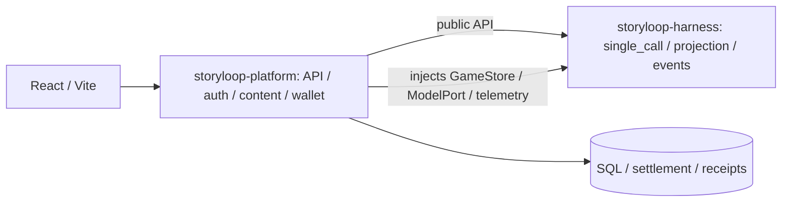

# StoryLoop Platform

[中文](README.md) · [English](README.en.md)

StoryLoop Platform is a runtime and player platform for AI interactive fiction. Its only current engine, `single_call`, assembles player-visible history, each relevant NPC's own experience, and world state into one scene context. One structured model call generates an ordinary turn; the backend validates and commits events, then updates each character's knowledge separately. The former multi-agent ReAct engine is archived for historical reference.

## Standalone platform repository / 独立平台仓库

The repository root is `storyloop-platform`; `web/` and `deploy/` contain frontend and deployment files. The reusable `storyloop-harness` lives in a separate repository. Platform requires `storyloop-harness>=0.1,<0.2` and imports its public APIs.

Harness 0.1.0 is pinned to `607fb706357f5d732a5bc588bd7f7587cd6ed3c9` in [storyloop0/storyloop-harness](https://github.com/storyloop0/storyloop-harness). CI, Docker and wheel tests build that commit through `scripts/build_harness.py`; `uv.lock` records the same source. Both projects use MIT. See [verification / 验证说明](docs/verification.md).

## Problems it addresses

- **Consistent character knowledge:** world facts, character knowledge, and player-visible information have separate boundaries. Committed events define world state; observations and worldbook entries are delivered according to visibility rules.
- **Open interaction with narrative momentum:** players can talk, inspect, and act while queued work, story events, and elapsed time continue to advance. A per-turn work budget prevents unbounded agent interaction.
- **Recoverable long-running play:** accounts, single-player saves, events, observations, turn results, and credit transactions are persisted. Request IDs support retrying the same action after a model failure.
- **Replaceable infrastructure:** model routes, storage, observability, and player profiles connect through configuration or interfaces, keeping scenario content separate from the platform runtime.

## Capabilities

| Component | Responsibility |
| --- | --- |
| Scenario packages and worldbook | Versioned character cards, initial state, mutable state fields, optional scripted action rules, opening text, scheduled work, and a JSON worldbook filtered by player or actor visibility before retrieval. |
| Narrative runtime | One structured model call proposes the decision, scene prose, relevant NPC replies, bounded status changes, and three follow-up actions. A bounded work queue commits character speech and environment events. Interactive mode displays separate NPC dialogue; novel mode presents second-person prose. Persisted NPC work is handled by the platform compatibility adapter. |
| State and time | Committed events update snapshots and produce recipient-specific observations; campaign scenarios combine scheduled milestones with elapsed time based on action duration. Scenarios may declare player-visible status fields and bounded per-turn changes. |
| Player platform | React and FastAPI provide accounts, a catalog, private scenario uploads, single-player saves, resume, and history; SSE streams turn stages and committed visible story segments. |
| Content moderation | Authors submit immutable scenario versions; reviewers inspect submissions and play isolated previews; administrators manage roles, account status, public releases, private-test invitations, and audit records. |
| Billing and profiles | Credits are settled from actual model token usage on successful turns; optional Mem0 extracts player-approved play preferences separately from NPC knowledge and game facts. |
| Observability | Optional Langfuse traces, sessions, and metrics expose model calls and work processing within a turn. |

## Architecture



On an ordinary turn, a context projector reads the histories visible to the player and to each relevant character. The scene model returns one structured proposal. Durable state changes pass validation against scenario-declared fields before the runtime commits events and delivers recipient-specific observations. Scripted choices and time advances remain data-driven. One model request can write messages for several characters at a heart-message gate. The only current engine is `single_call`; persisted `npc_reply` work is still processed by a platform compatibility adapter.

Authoritative game data is separate from generation context. `GameStore` manages events, observations, snapshots, and pending work; SQLAlchemy repositories use SQLite locally and PostgreSQL online. The current engine selects recent and relevant older committed events separately for the player and each NPC without another compression call. Source events are never deleted. Optional Mem0 player profiles remain separate from game facts. Set context limits with `models.context_windows` and `runtime.context_window_tokens`. The worldbook currently uses visibility-scoped JSON entry retrieval rather than vector RAG. Models are routed per task through an OpenAI-compatible API. Online browser sessions use `Secure`, `HttpOnly` cookies.

## Repository layout

```text
src/storyloop_platform/   API, SQL, config, billing and CLI
web/                      React frontend
deploy/                   Deployment files
config/       Local and online configuration examples
examples/     Public synthetic scenario packages
deploy/ecs/   Single-ECS Docker Compose deployment
```

## Quick start

Build into an empty `dist/harness` directory. Installation names the generated wheel explicitly, so the index cannot substitute another harness release.

Use Python 3.12+ and Node.js 20.19+. From the repository root, run these commands in Windows CMD or PowerShell:

```cmd
py -3.12 -m venv .venv
.\.venv\Scripts\python.exe scripts\build_harness.py --out-dir dist\harness
.\.venv\Scripts\python.exe -m pip install dist/harness/storyloop_harness-0.1.0-py3-none-any.whl -e ".[agents,portal]"
```

After installing the test extra, run the offline installation regression:

```cmd
.\.venv\Scripts\python.exe -m pytest tests/test_platform_wheel.py -q
```

For live models, create a local credentials file and set `models.api_key` to a pay-as-you-go Bailian key. Git ignores the file. `config/local.json` defaults to `deepseek-v4.1-flash` on the Hong Kong endpoint; use `config/bailian-token-plan.json` for the separate Token Plan profile. `STORY_BAILIAN_API_KEY` overrides the file when present.

`config/local.json` and `config/online.json` set `runtime.turn_engine` to `single_call`. Configuration loading rejects other engine values. The former multi-agent path is preserved for historical reference in Git tag `multi-agent-beta-archive-2026-10-r1`.

```cmd
copy config\application.local.example.json config\application.local.json
.\.venv\Scripts\python.exe -m storyloop_platform.cli.portal_api --catalog config\games.example.json --config config\local.json --db game.sqlite3
```

Start the frontend in another terminal:

```cmd
cd web
npm install
npm run dev
```

Open `http://127.0.0.1:5173` to register, create a save, and play. Vite proxies `/v1` to the local API at `127.0.0.1:8765`; API documentation is at `http://127.0.0.1:8765/docs`. On macOS/Linux, create the environment with `python3.12` and use `.venv/bin/python` for Python commands.

Local mode uses SQLite and disables player profiles by default. Online mode uses PostgreSQL. Optional Mem0 stores player preferences in embedded Qdrant on the ECS data volume and requires both a platform switch and player opt-in. Private scenarios and model keys are not included in the repository. See the [deployment guide](docs/deployment.md), [billing guide](docs/billing.md), and [user scenario design](docs/user-scenarios.md) for details.
