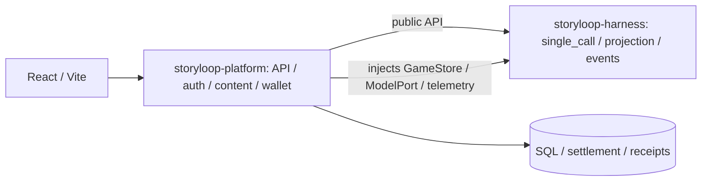

# StoryLoop Platform

[中文](README.md) · [English](README.en.md)

StoryLoop Platform 是面向 AI 互动叙事的运行时与玩家平台。当前唯一引擎 `single_call` 将玩家可见历史、相关 NPC 各自的经历和世界状态组装成一个场景上下文，以一次结构化模型调用生成普通回合；后端校验并提交事件，再分别更新角色认知。原有多 Agent ReAct 引擎已归档为历史参考。

## 两个独立包

本仓库包含两个可安装的 Python 发行包：[storyloop-harness](packages/harness/README.md) 是可复用的叙事库，[storyloop-platform](packages/platform/README.md) 是玩家与创作者产品。Platform 0.1.0 声明 `storyloop-harness>=0.1,<0.2`；CI 安装 harness 作业产出的精确 `0.1.0` wheel。平台只导入 harness 公开接口，harness 不依赖平台。本轮没有向包索引发布发行包。

仅使用库时执行 `python -m pip install ./packages/harness`，再运行 `python packages/harness/examples/offline_turn.py`。需要 Python 3.12+；该离线示例无需账号、SQL 数据库、前端或模型 Key。独立构建与安装步骤见[可复现验证](docs/verification.md)。

## 解决的问题

- **多角色认知一致性**：世界事实、角色所知和玩家所见分别建模。世界状态由已提交事件决定；观察和世界书条目按可见范围投递，避免 NPC 凭空知道其他角色的经历。
- **自由互动与主线节奏并存**：玩家可以交谈、观察和行动；待办任务、剧情事件与故事时间在回合中继续推进。每轮工作量有上限，防止 Agent 之间无限互相触发。
- **长线游玩的可恢复性**：账号、单人存档、事件、观察、回合结果和积分流水持久化。请求 ID 用于回合重试，模型故障后可以恢复同一条行动。
- **可替换的基础设施**：模型路由、存储、可观测性及玩家画像通过配置或接口接入，剧本内容与平台运行时分离。

## 核心能力

| 模块 | 职责 |
| --- | --- |
| 剧本包与世界书 | 版本化的角色卡、初始状态、可变状态字段、可选的特殊行动规则、开场、剧情任务和 JSON 世界书；检索前按玩家或角色的可见权限过滤。 |
| 叙事运行时 | 单次模型调用同时提出决策、场景正文、相关 NPC 回应、受限状态变化与三个行动建议；有界任务队列按因果顺序提交角色发言和环境事件。交互模式分开展示角色发言，小说模式统一输出第二人称正文。旧存档中的 NPC 待办由平台兼容适配器处理。 |
| 状态与时间 | 事件提交后更新快照，并生成各接收者的观察；日程剧本支持剧情节点与按行动时长流逝的故事时间。剧本可声明玩家可见数值及受限的回合变化。 |
| 玩家平台 | React 前端与 FastAPI API 提供注册登录、剧本目录、私有剧本上传、单人存档、续玩和历史记录；SSE 推送回合阶段与可见故事片段。 |
| 内容治理 | 作者提交不可变剧本版本；审核员查看送审内容并隔离试玩；管理员管理角色、账号、公开版本、内测邀请码与操作审计。 |
| 计费与画像 | 根据成功回合的模型 Token 用量结算积分；可选 Mem0 按玩家选择批量提炼游玩偏好，画像与 NPC 记忆、游戏事实隔离。 |
| 可观测性 | 可选 Langfuse 记录 trace、session 与指标，用于查看一次回合中的模型调用和任务处理链路。 |

## 架构



普通回合从玩家输入开始：上下文投影器分别读取玩家和相关角色有权知道的历史，场景模型一次返回完整故事回应和结构化提议。普通活动以事件经历保存；需要持久改变的物品或世界状态通过剧本声明的字段校验。发生值得回忆的共同互动时，同一结果可给直接参与的 NPC 留下简短事实记忆。运行时提交事件、生成观察，再按因果顺序处理待办工作。剧本选择与时间推进使用脚本数据；心动留言可在一次模型调用中为多位角色生成各自的短信。调度不依赖固定 Agent 图。当前唯一回合引擎是 `single_call`；旧存档中的 `npc_reply` 待办仍由平台兼容适配器处理。

权威游戏数据与生成上下文分开保存。`GameStore` 管理事件、观察、快照和待办工作；SQLAlchemy 仓储支持本地 SQLite 与线上 PostgreSQL。当前引擎每轮从完整历史中选取近期事件与较早的相关经历，分别投影到玩家和各 NPC 的上下文，不额外调用模型压缩。原始事件不会删除，玩家画像 Mem0 也不参与故事事实。`models.context_windows` 与 `runtime.context_window_tokens` 限制模型输入。世界书使用带可见范围的 JSON 条目检索，目前不是向量 RAG。模型调用通过 OpenAI 兼容接口按任务配置；浏览器会话在线上使用 `Secure`、`HttpOnly` Cookie。

## 项目结构

当前包职责、主要执行路径与剩余限制见[架构说明](docs/architecture.md)。

```text
packages/harness/   storyloop-harness Python runtime
packages/platform/
  src/storyloop_platform/   API, SQL, config, billing and CLI
  web/                      React frontend
  deploy/                   Deployment files
config/       本地与线上配置示例
examples/     可公开使用的合成剧本包
packages/platform/deploy/ecs/   单机 ECS Docker Compose 部署配置
```

## 快速开始

本工作区的正式代码根目录是 `D:/ai/storyloop-secure-session`，请在该目录创建独立 `.venv`。旧目录的用途、待归并改动和外部启动入口见[工作区清单](docs/workspace-map.md)。启动前清除终端继承的 `PYTHONPATH`，避免导入另一工作树。

需要 Python 3.12+ 和 Node.js 20.19+。以下命令适用于 Windows CMD 与 PowerShell，在仓库根目录执行：

```cmd
py -3.12 -m venv .venv
.\.venv\Scripts\python.exe -m pip install -e packages/harness -e "packages/platform[agents,portal]"
.\.venv\Scripts\python.exe scripts\check_environment.py --config config\local.json
```

检查必须成功，并且 `python` 和 `storyloop_platform` 都指向当前工作树；脚本报告 Git HEAD、配置路径和存储驱动，不读取或输出数据库连接密码、模型 Key。它只检查版本入口，不验证完整配置、数据库或模型连通性。`git_sha` 是提交版本，未提交的改动需另行核对。

先运行无需模型 Key 的离线示例：

```cmd
.\.venv\Scripts\python.exe packages\harness\examples\offline_turn.py
```

开发回归使用当前工作树的独立解释器；`pytest` 同时收集现有 unittest 类和函数式回归测试：

```cmd
.\.venv\Scripts\python.exe -m pip install -e packages/harness -e "packages/platform[agents,portal,observability,player-memory,test]"
.\.venv\Scripts\python.exe -m pytest tests -q
cd packages/platform/web
node --experimental-strip-types --test tests/*.test.mjs
npm run build
```

前端测试直接加载 TypeScript，需 Node.js 22.6+（本轮使用 24.16.0）；构建仍按上方 Vite 运行要求。离线测试不需要真实模型 Key，线上 PostgreSQL 验证需另行配置隔离测试库。

需要复现依赖和浏览器验收时，使用仓库 `uv.lock` 与前端锁文件，具体命令见[可复现验证](docs/verification.md)。CI 配置同时保留 Windows/Linux 后端验证和模拟 API 的浏览器交互测试；远程 CI 与 PostgreSQL 的实际执行结果需分别确认。

使用真实模型时，创建本机配置文件，将 `models.api_key` 填为可用的百炼按量付费 Key；该文件被 Git 忽略。`config/local.json` 默认使用香港端点的 `deepseek-v4.1-flash`，Token Plan 个人版请改用专用的 `config/bailian-token-plan.json`。`STORY_BAILIAN_API_KEY` 环境变量会覆盖文件中的 Key。

`config/local.json` 与 `config/online.json` 使用 `runtime.turn_engine: "single_call"`，配置加载会拒绝其他引擎值。旧版多 Agent 流程保存在历史 Git 标签 `multi-agent-beta-archive-2026-10-r1` 中，仅供历史参考。

```cmd
copy config\application.local.example.json config\application.local.json
.\.venv\Scripts\python.exe -m storyloop_platform.cli.portal_api --catalog config\games.example.json --config config\local.json --db game.sqlite3
```

另开终端启动前端：

```cmd
cd packages/platform/web
npm install
npm run dev
```

访问 `http://127.0.0.1:5173` 注册、创建存档并游玩。Vite 将 `/v1` 代理到本机 API `127.0.0.1:8765`；API 文档位于 `http://127.0.0.1:8765/docs`。macOS/Linux 使用 `python3.12` 创建虚拟环境，并将 Python 路径换为 `.venv/bin/python`。

本地默认使用 SQLite，玩家画像默认关闭。线上配置使用 PostgreSQL；Mem0 可选用 ECS 云盘上的嵌入式 Qdrant 保存玩家偏好，需平台开关和玩家授权同时开启。私有剧本和密钥不放在仓库中。部署、积分规则和剧本包格式分别见[部署说明](docs/deployment.md)、[计费说明](docs/billing.md)与[用户剧本设计](docs/user-scenarios.md)。
