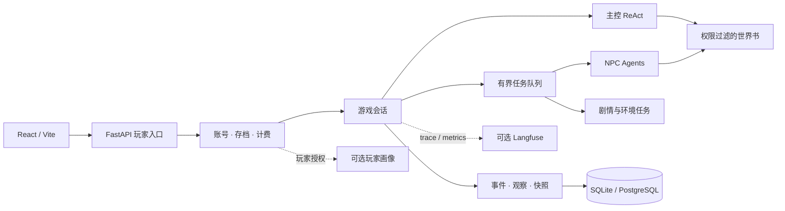

# StoryLoop Platform

[中文](README.md) · [English](README.en.md)

StoryLoop Platform 是面向 AI 互动叙事的多 Agent 运行时与玩家平台。它将自由输入、独立角色、持续变化的世界和有节奏的主线放进同一条可追溯的因果链：玩家的行动先改变权威游戏状态，角色再依据各自能感知到的信息回应，最终生成面向玩家的故事内容。

## 解决的问题

- **多角色认知一致性**：世界事实、角色所知和玩家所见分别建模。世界状态由已提交事件决定；观察和世界书条目按可见范围投递，避免 NPC 凭空知道其他角色的经历。
- **自由互动与主线节奏并存**：玩家可以交谈、观察和行动；待办任务、剧情事件与故事时间在回合中继续推进。每轮工作量有上限，防止 Agent 之间无限互相触发。
- **长线游玩的可恢复性**：账号、单人存档、事件、观察、回合结果和积分流水持久化。请求 ID 用于回合重试，模型故障后可以恢复同一条行动。
- **可替换的基础设施**：模型路由、存储、可观测性及玩家画像通过配置或接口接入，剧本内容与平台运行时分离。

## 核心能力

| 模块 | 职责 |
| --- | --- |
| 剧本包与世界书 | 版本化的角色卡、初始状态、行动规则、开场、剧情任务和 JSON 世界书；检索前按玩家或角色的可见权限过滤。 |
| 叙事运行时 | 主控 ReAct 解释玩家输入并协调行动；每个 NPC 使用独立 AgentScope Agent；有界任务队列处理 NPC 回复、环境变化和剧情事件。 |
| 状态与时间 | 事件提交后更新快照，并生成各接收者的观察；日程剧本支持剧情节点与按行动时长流逝的故事时间。 |
| 玩家平台 | React 前端与 FastAPI API 提供注册登录、剧本目录、私有剧本上传、单人存档、续玩和历史记录；SSE 推送回合阶段与可见故事片段。 |
| 内容治理 | 作者提交不可变剧本版本；审核员查看送审内容并隔离试玩；管理员管理角色、账号状态、公开版本与操作审计。 |
| 计费与画像 | 根据成功回合的模型 Token 用量结算积分；可选 Mem0 按玩家选择批量提炼游玩偏好，画像与 NPC 记忆、游戏事实隔离。 |
| 可观测性 | 可选 Langfuse 记录 trace、session 与指标，用于查看一次回合中的模型调用和任务处理链路。 |

## 架构



一次回合从玩家输入开始：主控读取可用的世界知识和当前状态，决定行动与相关角色；运行时提交事件、生成观察，再按因果顺序处理待办工作；叙述层汇总玩家可见的结果，并把下一步建议放在独立区域。调度按任务类型接入处理器，不依赖固定的 Agent 图。剧本包提供故事内容，平台代码负责执行、隔离与持久化。

权威游戏数据与 Agent 上下文分开保存。`GameStore` 管理事件、观察、快照和待办工作；SQLAlchemy 仓储支持本地 SQLite 与线上 PostgreSQL。世界书使用带可见范围的 JSON 条目检索，目前不是向量 RAG。模型调用通过 OpenAI 兼容接口按任务配置；浏览器会话在线上使用 `Secure`、`HttpOnly` Cookie。

## 项目结构

```text
src/story_harness/
  core/       事件、状态转换、观察与计费契约
  world/      剧本包与世界书
  agents/     主控、NPC、选择器与叙述 Agent
  runtime/    回合调度、剧情、时间和呈现
  adapters/   模型配置、SQL 存储与遥测
  portal/     账号、存档、画像、积分和 HTTP API
  cli/        本地演示与服务入口
web/          React 前端
config/       本地与线上配置示例
examples/     可公开使用的合成剧本包
deploy/ecs/   单机 ECS Docker Compose 部署配置
```

## 快速开始

需要 Python 3.12+ 和 Node.js 20.19+。以下命令适用于 Windows CMD 与 PowerShell，在仓库根目录执行：

```cmd
py -3.12 -m venv .venv
.\.venv\Scripts\python.exe -m pip install -e ".[agents,portal]"
```

先运行无需模型 Key 的离线示例：

```cmd
.\.venv\Scripts\python.exe -m story_harness.cli.interaction_demo examples\freeform
```

使用真实模型时，创建本机配置文件，将 `models.api_key` 填为可用的百炼 Key；该文件被 Git 忽略。`STORY_BAILIAN_API_KEY` 环境变量会覆盖文件中的 Key。

```cmd
copy config\application.local.example.json config\application.local.json
.\.venv\Scripts\python.exe -m story_harness.cli.portal_api --catalog config\games.example.json --config config\local.json --db game.sqlite3
```

另开终端启动前端：

```cmd
cd web
npm install
npm run dev
```

访问 `http://127.0.0.1:5173` 注册、创建存档并游玩。Vite 将 `/v1` 代理到本机 API `127.0.0.1:8765`；API 文档位于 `http://127.0.0.1:8765/docs`。macOS/Linux 使用 `python3.12` 创建虚拟环境，并将 Python 路径换为 `.venv/bin/python`。

本地默认使用 SQLite，玩家画像默认关闭。线上配置使用 PostgreSQL；Mem0 可选用 ECS 云盘上的嵌入式 Qdrant 保存玩家偏好，需平台开关和玩家授权同时开启。私有剧本和密钥不放在仓库中。部署、积分规则和剧本包格式分别见[部署说明](docs/deployment.md)、[计费说明](docs/billing.md)与[用户剧本设计](docs/user-scenarios.md)。
