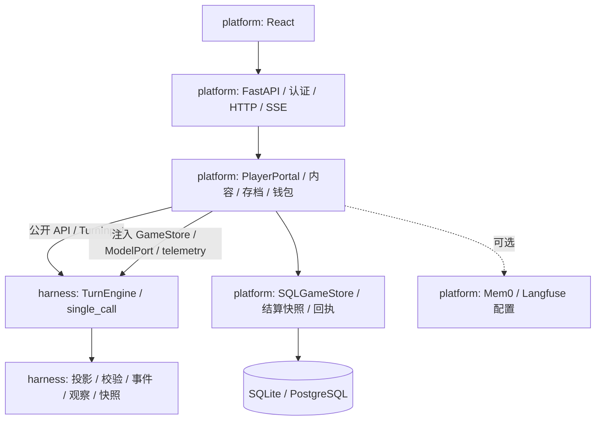

# 当前架构

StoryLoop 当前在单仓库内维护两个可安装发行包：`storyloop-harness` 叙事库与 `storyloop-platform` 玩家和创作者平台。产品仍采用 React + FastAPI 的模块化单体部署。前端负责玩家、创作者和审核界面；单个后端进程负责业务编排，SQL 数据库保存权威状态，剧本文件按不可变版本保存。当前仍建议单 API worker。

当前唯一回合引擎 `single_call` 通过 AgentScope 2.0.9 的模型与结构化输出接口生成回合，配置加载会拒绝其他引擎值。旧版多 Agent 引擎保存在历史 Git 标签 `multi-agent-beta-archive-2026-10-r1` 中。项目自身继续负责游戏状态、权限投影和回合结算；旧存档的 `npc_reply` 待办由平台兼容适配器处理，该适配器属于 platform，独立 harness 库不含平台兼容实现。

Python 导入方向只有 `storyloop_platform` → `storyloop_harness` 的公开表面。
图中的存储注入通过 harness 定义的协议实现，不产生反向平台导入。
Platform 0.1.0 的依赖声明为 `storyloop-harness>=0.1,<0.2`；锁文件与 CI
当前验证 0.1.0 制品。CI 平台作业下载独立 harness 作业的 wheel，不使用
相邻 harness 源目录或根目录 `PYTHONPATH` 提供运行时依赖。

## 代码职责

| 包与模块 | 当前职责 |
| --- | --- |
| harness 的公开 facade、contracts、ports | `ScenarioPackage`、`TurnEngine`、`TurnInput`、`TurnOutcome`、存储与模型协议、可选 `CampaignContext` |
| harness 的 advanced、generation、telemetry、usage | 持久化和旧工作适配所需契约、生成适配、遥测协议与无价格的模型用量 |
| harness 的 testing | 内存存储和确定性模型；独立离线示例与适配器契约测试 |
| platform 的 portal/ | 身份与存档所有权、HTTP/SSE、内容发布审核、钱包结算与幂等回执 |
| platform 的 adapters/、migrations/ | SQL 存储、数据库迁移、运行配置、模型路由与服务遥测配置 |
| platform 的 legacy/ | 旧存档 `npc_reply` 待办恢复适配 |
| platform 的 cli/、defaults/ | 安装后可用的维护命令与默认配置 |
| packages/platform/web/、deploy/ | React 玩家与创作者界面、部署和运维文件 |

harness 内部 `core/`、`runtime/`、`world/`、`agents/`、`models/`、`adapters/`
不是平台可导入的扩展接口。`GameStore.commit` 继续使用预期版本并保持现有
`Snapshot`、`WorldEvent`、`Observation`、`PendingWork` 持久化字段及 SQL 行含义。
普通回合为一次结构化场景生成加确定性校验与提交；旧待办或其他生成任务
不承诺每次也只调用模型一次。公开接口详情见 [harness README](../packages/harness/README.md)。

## 主要执行路径

**玩家回合：** 浏览器生成 request_id → 验证会话和存档所有权 → 读取已有回执/结算快照 → 投影上下文 → 调用引擎 → 校验并提交事件和状态 → 保存完整回合结算快照 → 结算与保存幂等回执 → 返回最终视图。SSE 断流时浏览器保留原请求标识；只有明确尚未开始的失败才能解除待确认状态并重新编辑。

**剧本内容：** 上传压缩包并验证 → 写入新版本包与元数据 → 作者私有游玩或送审 → 审核固定版本 → 公共发布。存档绑定包版本及指纹。发布、送审、版本入库、草稿删除共用同一生命周期锁；草稿删除同时记录文件清理意图，文件清理失败可重试。

**准备式开场：** 剧本声明开场文本、角色资料和玩家身份池 → 根据所选身份选项或定制字段渲染安全模板 → 建档并保存开场。该准备式路径不在创建存档时生成整组角色。

## 已收敛的边界与仍存在的耦合

结算快照、生命周期锁、文件清理、失败契约已独立成模块；前端审核详情与待确认请求也有独立状态逻辑。数据库是游戏事实和账务的权威来源，Mem0 玩家偏好不改写世界事实。

PlayerPortal 仍承担较多业务编排，尚未完整拆成存档服务、内容服务和回合应用服务。旧版 beta 仅在历史 Git 标签中保留作参考，平台仅装配单次调用引擎，并按需装配旧待办兼容适配器；一个模型同时看到多名角色上下文不构成角色间的硬隔离。

结算快照只覆盖完整回合生成后的恢复窗口，尚未实现逐次模型结果和用量 journal；早期阶段缺少计量证据时会要求人工恢复。现有锁和快照也不代表已经支持多实例并发执行。

长存档已增加 SQL 关联索引与近期读取限制，但旧记忆选择及完整历史接口仍加载较多历史。PostgreSQL 并发实测、完整客户端关闭、备份恢复演练和生产发布仍是后续工作。

验证与操作说明：[可复现验证](verification.md)、[结算恢复边界](turn-recovery.md)、[包清理](package-cleanup.md)、[性能基线](performance-baseline.md)、[部署](deployment.md)。

## 后续分仓门槛

两个包独立构建、安装和平台集成通过后，再另立 GitHub organization 与物理
分仓计划。harness 先发行版本，platform 再更新依赖来源与版本；分仓只应改变
版本获取方式、Git remote 和运维链接，不能改变公开模块导入或回合行为。
本阶段不创建 organization、不迁移远程仓库、不发布发行包。
