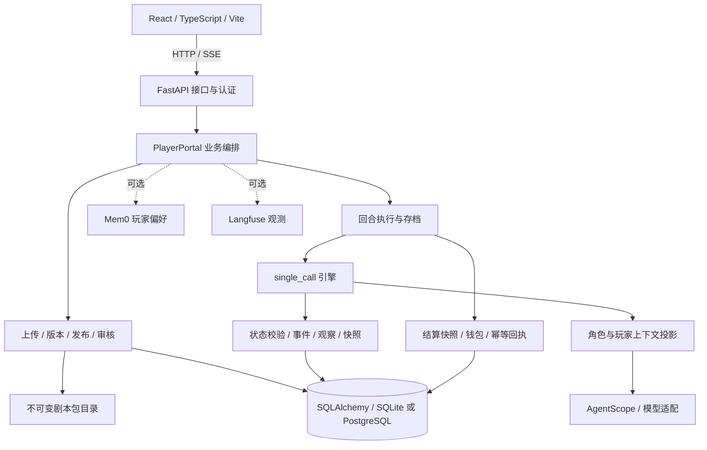

# 当前架构

StoryLoop 是一个 React + FastAPI 的模块化单体。前端负责玩家、创作者和审核界面；单个后端进程负责业务编排，SQL 数据库保存权威状态，剧本文件按不可变版本保存。当前仍建议单 API worker。

当前唯一回合引擎 `single_call` 通过 AgentScope 2.0.9 的模型与结构化输出接口生成回合，配置加载会拒绝其他引擎值。旧版多 Agent 引擎保存在历史 Git 标签 `multi-agent-beta-archive-2026-10-r1` 中。项目自身继续负责游戏状态、权限投影和回合结算；旧存档的 `npc_reply` 待办由平台兼容适配器处理，该适配器不属于未来公开的 harness 库。

## 代码职责

| 模块 | 当前职责 |
| --- | --- |
| packages/platform/web/ | 玩家游玩、存档、上传和审核；保存待确认请求 ID，消费 SSE 进度与完成结果 |
| portal/http_api.py | HTTP/SSE、Cookie/Bearer、Host/Origin、错误映射、回合停机等待 |
| portal/service.py | PlayerPortal 外观与依赖装配，协调账号、内容访问、存档、回合、计费、玩家画像 |
| portal/user_scenarios.py、moderation.py | 上传校验、版本管理、私有可玩版本、送审与公共发布 |
| portal/scenario_lifecycle.py、package_cleanup.py | 内容生命周期事务锁、持久化文件清理意图、引用复查 |
| runtime/ | 回合、剧情、时间推进、状态提议校验、事件提交、任务调度与呈现 |
| agents/ | 提示与上下文投影、模型结果结构、叙述、NPC 等生成任务 |
| core/ | 状态、事件、观察、效果等基础契约和计费规则 |
| world/ | 剧本包、世界书、蓝本、角色资料、准备式开场模板 |
| adapters/ | SQL 存储、运行配置、模型配置、遥测等基础设施适配 |
| migrations/ | Alembic 数据库迁移；本轮增加结算快照、清理队列和观察关联索引 |

## 主要执行路径

**玩家回合：** 浏览器生成 request_id → 验证会话和存档所有权 → 读取已有回执/结算快照 → 投影上下文 → 调用引擎 → 校验并提交事件和状态 → 保存完整回合结算快照 → 结算与保存幂等回执 → 返回最终视图。SSE 断流时浏览器保留原请求标识；只有明确尚未开始的失败才能解除待确认状态并重新编辑。

**剧本内容：** 上传压缩包并验证 → 写入新版本包与元数据 → 作者私有游玩或送审 → 审核固定版本 → 公共发布。存档绑定包版本及指纹。发布、送审、版本入库、草稿删除共用同一生命周期锁；草稿删除同时记录文件清理意图，文件清理失败可重试。

**准备式开场：** 剧本声明开场文本、角色资料和玩家身份池 → 根据所选身份选项或定制字段渲染安全模板 → 建档并保存开场。该准备式路径不在创建存档时生成整组角色。

## 已收敛的边界与仍存在的耦合

结算快照、生命周期锁、文件清理、失败契约已独立成模块；前端审核详情与待确认请求也有独立状态逻辑。数据库是游戏事实和账务的权威来源，Mem0 玩家偏好不改写世界事实。

PlayerPortal 仍承担较多业务编排，尚未完整拆成存档服务、内容服务和回合应用服务。旧版 beta 代码仍保留作历史参考，平台仅装配单次调用引擎，并按需装配旧待办兼容适配器；一个模型同时看到多名角色上下文不构成角色间的硬隔离。

结算快照只覆盖完整回合生成后的恢复窗口，尚未实现逐次模型结果和用量 journal；早期阶段缺少计量证据时会要求人工恢复。现有锁和快照也不代表已经支持多实例并发执行。

长存档已增加 SQL 关联索引与近期读取限制，但旧记忆选择及完整历史接口仍加载较多历史。PostgreSQL 并发实测、完整客户端关闭、备份恢复演练和生产发布仍是后续工作。

验证与操作说明：[可复现验证](verification.md)、[结算恢复边界](turn-recovery.md)、[包清理](package-cleanup.md)、[性能基线](performance-baseline.md)、[部署](deployment.md)。
